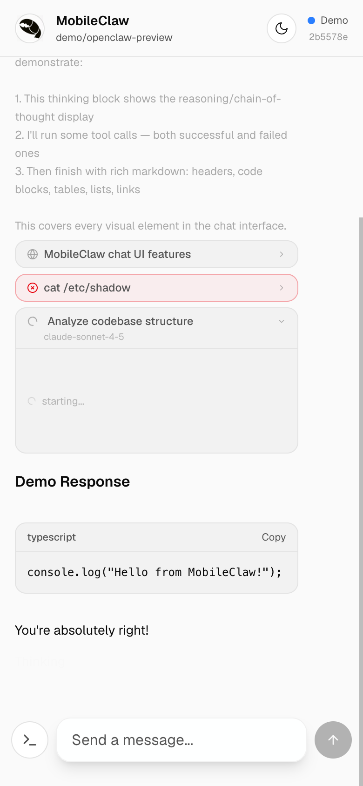
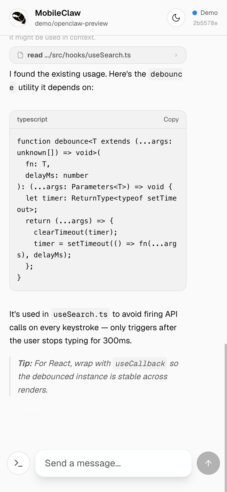
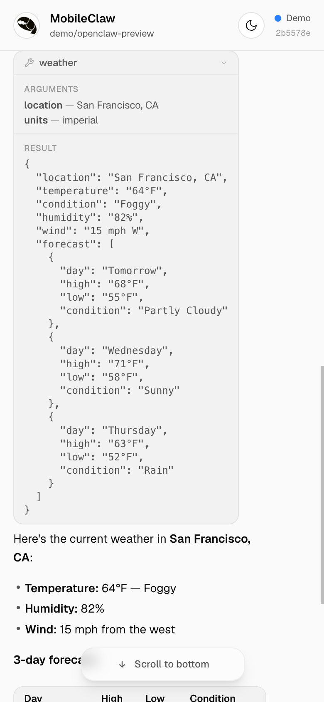
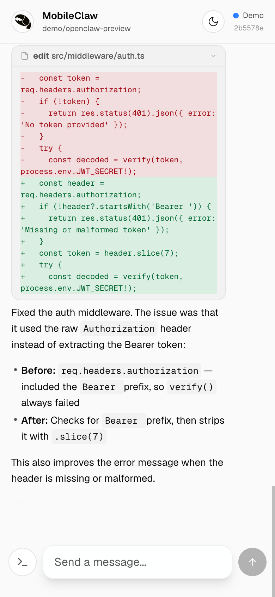
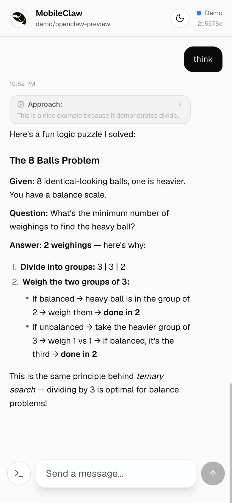
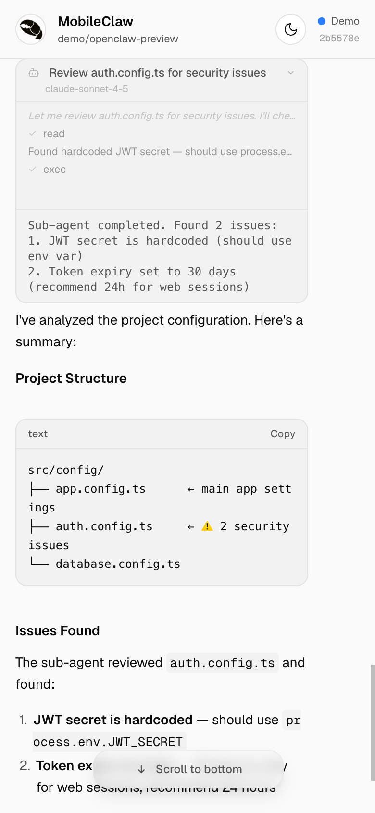
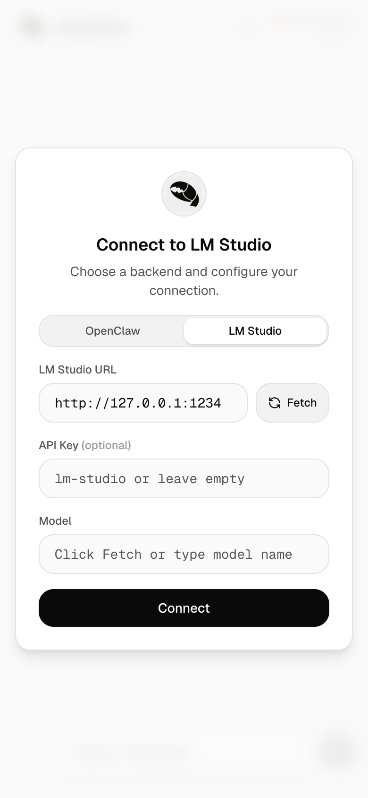

<div align="center">

# MobileClaw


A mobile-first chat UI for [OpenClaw](https://github.com/openclaw/openclaw) and LM Studio

**[Try the Live Demo](https://mobileclaw.vercel.app?demo)**

<br />

&nbsp;&nbsp;

</div>

<br />

## Features

### Streaming & Markdown

Real-time word-by-word streaming with rich markdown rendering — headings, lists, tables, code blocks with syntax labels and one-tap copy.

<div align="center">

</div>

### Tool Calls

Live tool execution with running/success/error states. See arguments, results, and inline diffs — all with smooth slide-in animations.

<div align="center">

</div>

### Inline Diffs

Edit tool calls render as color-coded inline diffs — red for removed lines, green for additions. No need to leave the chat to review changes.

<div align="center">

</div>

### Thinking / Reasoning

Expandable reasoning blocks show the model's chain-of-thought. Tap to expand or collapse — the thinking duration badge shows how long the model reasoned.

<div align="center">

</div>

### Sub-Agent Activity

When the agent spawns sub-agents, a live activity feed shows their reasoning, tool calls, and results streaming in real time.

<div align="center">

</div>

### LM Studio Support

Run local models with full chat UI support. Auto-fetches available models, parses `<think>` tags for reasoning display, and streams responses via the OpenAI-compatible API. No cloud required.

<div align="center">

</div>

### And More

- **Command palette** — slide-up sheet with all OpenClaw slash commands, search and autocomplete
- **Dark mode** — automatic theme switching via CSS custom properties
- **Mobile-first** — optimized for iOS Safari with viewport fixes and smooth scroll animations
- **Demo mode** — fully functional without a backend server
- **Push notifications** — get notified when the agent finishes responding

<br />

## Quick Start

```bash
git clone https://github.com/wende/mobileclaw && cd mobileclaw && pnpm install && pnpm dev
```

Open [localhost:3000?demo](http://localhost:3000?demo) to try it instantly.

## Connecting to a Backend

### OpenClaw (WebSocket)

1. Start your OpenClaw instance
2. Enter the server URL (e.g. `ws://127.0.0.1:18789`)
3. Optionally enter a gateway auth token
4. Click **Connect**

### LM Studio (HTTP)

1. Start LM Studio and enable the local server (default: `http://localhost:1234`)
2. Select "LM Studio" in the setup dialog and enter the URL
3. Pick your model from the dropdown

Connection settings persist across page reloads via localStorage.

## Tech Stack

- **Next.js 16** — App Router, Turbopack
- **Tailwind CSS v4** — OKLch color tokens, `@utility` custom utilities
- **TypeScript** — type-safe WebSocket protocol handling
- **Zero UI dependencies** — hand-rolled components with inline SVG icons

## License

MIT
