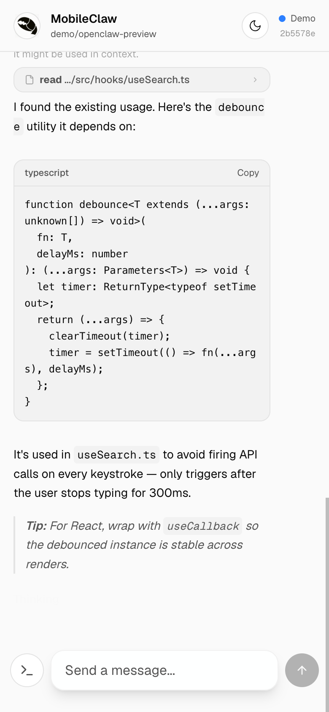
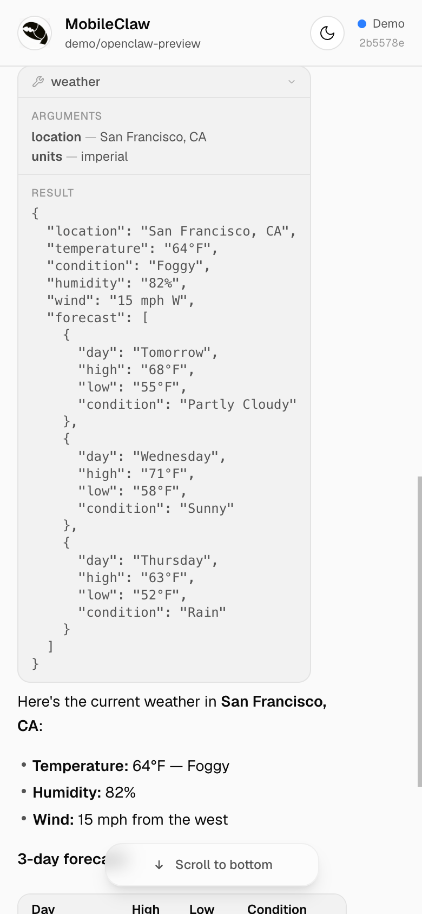
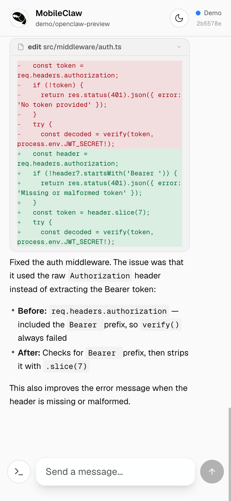
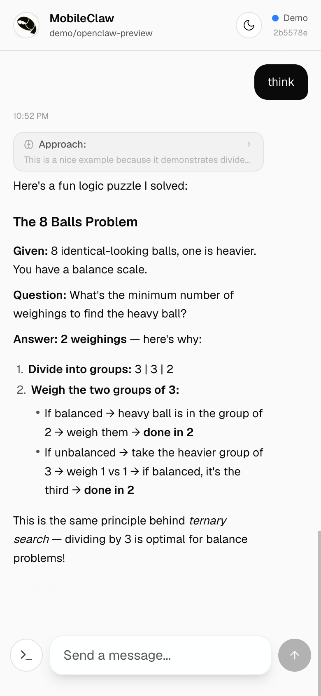
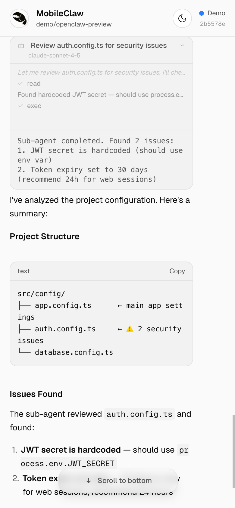
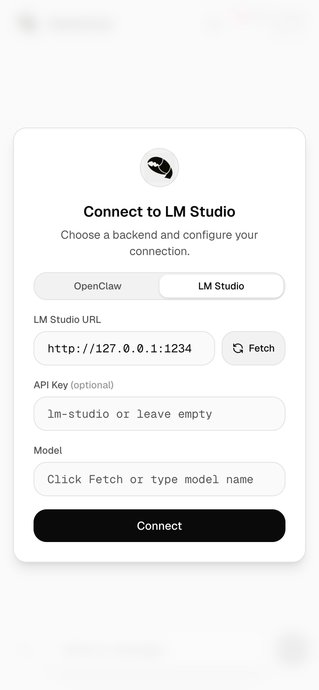

<div align="center">

# MobileClaw
A mobile-first chat UI for [OpenClaw](https://github.com/openclaw/openclaw) and LM Studio

**[Try the Live Demo](https://mobileclaw.vercel.app?demo)**

**iOS App Soon™!**

## Why? 
### These two screens show the same conversation

### OpenClaw


### With MobileClaw


## Features

### Streaming & Markdown

Real-time word-by-word streaming with rich markdown rendering — headings, lists, tables, code blocks with syntax labels and one-tap copy.

<div align="center">

</div>

### Tool Calls

Live tool execution with running/success/error states. See arguments, results, and inline diffs — all with smooth slide-in animations.

<div align="center">

</div>

### Inline Diffs

Edit tool calls render as color-coded inline diffs — red for removed lines, green for additions. No need to leave the chat to review changes.

<div align="center">

</div>

### Thinking / Reasoning

Expandable reasoning blocks show the model's chain-of-thought. Tap to expand or collapse — the thinking duration badge shows how long the model reasoned.

<div align="center">

</div>

### Sub-Agent Activity

When the agent spawns sub-agents, a live activity feed shows their reasoning, tool calls, and results streaming in real time.

<div align="center">

</div>

### LM Studio Support

Run local models with full chat UI support. Auto-fetches available models, parses `<think>` tags for reasoning display, and streams responses via the OpenAI-compatible API. No cloud required.

<div align="center">

</div>

### Embeddable Widget

Drop MobileClaw into any page as an iframe. The `?detached` query param renders a compact, chromeless chat widget — no header, no setup dialog, no pull-to-refresh. Pass `?detached&url=wss://host&token=abc` to auto-connect to an OpenClaw backend without user setup.

### And More

- **Command palette** — slide-up sheet with all OpenClaw slash commands, search and autocomplete
- **Dark mode** — Linear-inspired palette with stepped grayscale elevation, off-white text, and desaturated accents
- **Mobile-first** — optimized for iOS Safari with custom rAF-driven scroll animations, momentum bounce, keyboard-resize handling (including SwiftKey), and frosted-glass scroll-to-bottom pill
- **Demo mode** — fully functional without a backend server
- **File & image uploads** — attach any file type; uploaded via [Litterbox](https://litterbox.catbox.moe/) (temporary hosting, 72h expiry). Litterbox is a free community service — [consider donating](https://ko-fi.com/catboxmoe)
- **Push notifications** — get notified when the agent finishes responding
- **Bot protection** — optional Cloudflare Turnstile gate via `NEXT_PUBLIC_TURNSTILE_SITE_KEY` env var

<br />

## Quick Start

```bash
git clone https://github.com/wende/mobileclaw && cd mobileclaw && pnpm install && pnpm dev
```

Open [localhost:3000?demo](http://localhost:3000?demo) to try it instantly.

## Connecting to a Backend

See [SETUP_SKILL.md](SETUP_SKILL.md) for step-by-step instructions covering localhost, LAN, and Tailscale setups.

## Contributing

```bash
git clone https://github.com/wende/mobileclaw && cd mobileclaw
pnpm install && pnpm dev
```

This starts a dev server with Turbopack at [http://localhost:3000](http://localhost:3000).

For development, use [Scenario A](SETUP_SKILL.md#a-everything-on-one-machine) (everything on one machine) or [Scenario C](SETUP_SKILL.md#c-openclaw-on-a-separate-machine) (OpenClaw running elsewhere) from the setup guide.

## Tech Stack

- **Next.js 16** — App Router, Turbopack
- **Tailwind CSS v4** — OKLch color tokens, `@utility` custom utilities
- **TypeScript** — type-safe WebSocket protocol handling, enforced in build via `tsc`
- **ESLint 9** — flat config with type-aware `typescript-eslint` rules
- **Zero UI dependencies** — hand-rolled components with inline SVG icons

## License

MIT
