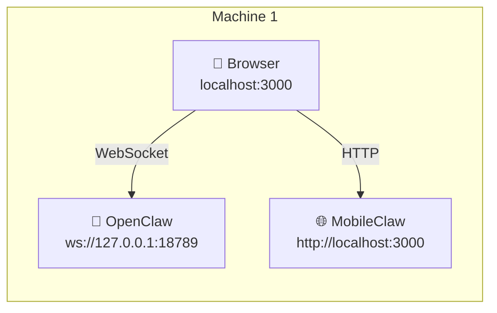
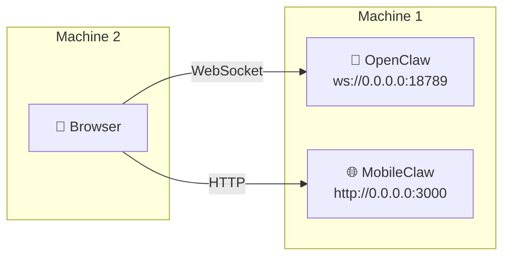
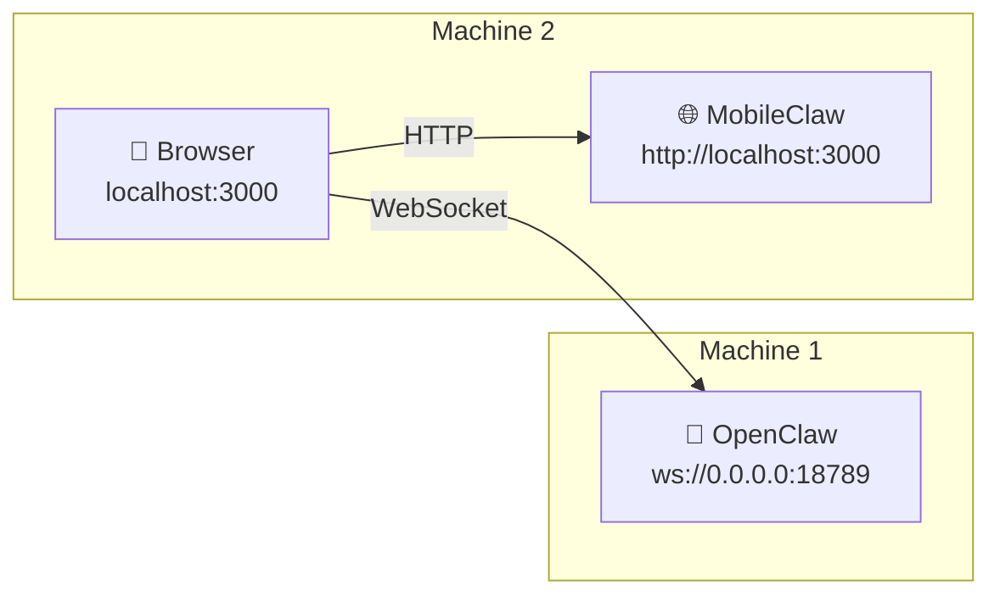
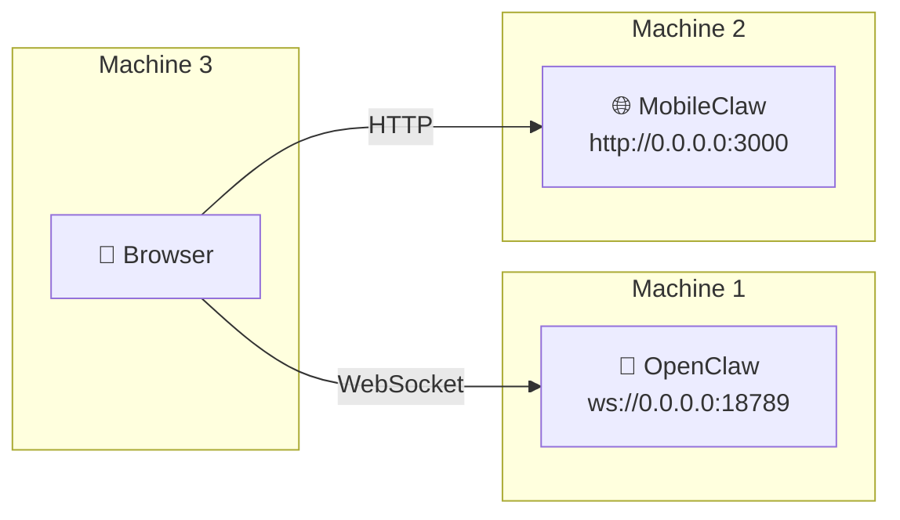

# MobileClaw Setup Skill

You are helping a user set up **MobileClaw** — a mobile chat UI that connects to an OpenClaw backend.

There are three pieces: **OpenClaw** (the backend), **MobileClaw** (the web server), and the **Browser** (where you use it). Pick the scenario that matches your setup.

## Which scenario are you?

| Scenario | What it means | Recommended? |
|----------|--------------|:---:|
| [A. All on one machine](#a-everything-on-one-machine) | OpenClaw, MobileClaw, and browser all on the same computer | Simple but desktop-only |
| [B. Browser on a different device](#b-browser-on-a-different-device) | OpenClaw + MobileClaw on your server, browser on your phone/tablet | **Best for most people** |
| [C. OpenClaw on a separate machine](#c-openclaw-on-a-separate-machine) | OpenClaw on machine 1, MobileClaw + browser on machine 2 | When your GPU box is headless |
| [D. All three separate](#d-all-three-separate) | OpenClaw, MobileClaw, and browser each on a different machine | Full distributed setup |

**Scenario B is recommended** — run OpenClaw and MobileClaw on the same box, then open it from your phone. One machine to manage, and the browser just needs a URL.

---

## Prerequisites (all scenarios)

- **Node.js >= 20** (`node --version`)
- **pnpm** (`corepack enable && corepack prepare pnpm@latest --activate`)
- **OpenClaw 2026.2+** installed and the gateway running somewhere

---

## A. Everything on one machine



### Install and run MobileClaw

```bash
git clone https://github.com/wende/mobileclaw && cd mobileclaw
pnpm install && pnpm build && pnpm start
```

### Connect

Open [http://localhost:3000](http://localhost:3000). In the setup dialog:

- URL: `ws://127.0.0.1:18789`
- Token: from `~/.openclaw/openclaw.json` → `gateway.auth.token` (if auth is enabled)

Done.

---

## B. Browser on a different device



### 1. Make OpenClaw listen on all interfaces

Edit `~/.openclaw/openclaw.json` on machine 1:

```json
{ "gateway": { "host": "0.0.0.0" } }
```

Restart the gateway: `openclaw gateway stop && sleep 3 && openclaw gateway install`

### 2. Install and run MobileClaw

```bash
git clone https://github.com/wende/mobileclaw && cd mobileclaw
pnpm install && pnpm build && npx next start --hostname 0.0.0.0
```

### 3. Find machine 1's address

Same LAN:
```bash
# macOS
ipconfig getifaddr en0
# Linux
hostname -I | awk '{print $1}'
```

Different networks — use [Tailscale](https://tailscale.com) (free): install on both devices, then `tailscale status` to get the hostname (e.g. `my-macbook`).

### 4. Connect from the browser

Open `http://<machine1-ip>:3000` (or `http://my-macbook:3000` with Tailscale).

In the setup dialog:

- URL: `ws://<machine1-ip>:18789` (same IP/hostname as above)
- Token: if auth is enabled

**Key point:** the browser connects to OpenClaw *directly* via WebSocket — not through MobileClaw. So OpenClaw must be reachable from the browser's device.

---

## C. OpenClaw on a separate machine



### 1. Make OpenClaw listen on all interfaces

On machine 1, edit `~/.openclaw/openclaw.json`:

```json
{ "gateway": { "host": "0.0.0.0" } }
```

Restart: `openclaw gateway stop && sleep 3 && openclaw gateway install`

### 2. Install and run MobileClaw on machine 2

```bash
git clone https://github.com/wende/mobileclaw && cd mobileclaw
pnpm install && pnpm build && pnpm start
```

### 3. Connect

Open [http://localhost:3000](http://localhost:3000) on machine 2. In the setup dialog:

- URL: `ws://<machine1-ip>:18789`
- Token: if auth is enabled

Machine 1 must be reachable from machine 2 — same LAN or Tailscale.

---

## D. All three separate



This is scenario B + C combined. Both OpenClaw and MobileClaw must bind to `0.0.0.0`, and all three machines must be able to reach each other.

### 1. OpenClaw on machine 1

Edit `~/.openclaw/openclaw.json`:

```json
{ "gateway": { "host": "0.0.0.0" } }
```

Restart: `openclaw gateway stop && sleep 3 && openclaw gateway install`

### 2. MobileClaw on machine 2

```bash
git clone https://github.com/wende/mobileclaw && cd mobileclaw
pnpm install && pnpm build && npx next start --hostname 0.0.0.0
```

### 3. Browser on machine 3

Open `http://<machine2-ip>:3000`. In the setup dialog:

- URL: `ws://<machine1-ip>:18789`
- Token: if auth is enabled

All three machines must be on the same network or connected via Tailscale.

---

## Troubleshooting

| Problem | Fix |
|---------|-----|
| Setup dialog keeps reappearing | Clear `openclaw-*` keys from browser localStorage |
| WebSocket fails | Use `ws://` not `http://`. Check gateway is running. |
| Can't reach from another device | Backend must bind `0.0.0.0`. Use LAN IP, not `localhost`. Check firewall. |
| Mixed content (HTTPS page + ws://) | Serve MobileClaw over HTTP too, or use `wss://` |
